# What will be scraped

How to edit sources: [README.md](../README.md#scraping-search-index).

Generated from `config/` by `scripts/generate-scrape-mermaid.mjs`.
Re-run after editing scrape config:

```bash
npm run diagram:scrape
```

## Summary

| Channel | Count | Config |
|--------|------:|--------|
| Generic sites | 10 | `generic-sites.mjs` |
| Single URLs | 26 | `single-urls/urls.json` |
| GitHub repos (crawl) | 40 | `github-repos.json` |
| GitHub repos (skipCrawl) | 1 | `github-repos.json` |
| Manual index entries | 2 | `manual-entries/` |
| Manual sitemaps | 2 | `manual-sitemaps/` |

## Diagram

```mermaid
flowchart TB
  ROOT["config/"]
  OUT["search-index-entries/*.jsonl"]

  subgraph GEN["Generic sites — generic-sites.mjs"]
    direction TB
    g_configESSIFlabs["eSSIF-Lab<br/><small>remote XML · essif-lab.github.io/framework/sitemap.xml</small>"]
    g_configGleif["Gleif website<br/><small>HTML querySelector · www.gleif.org/en/meta/sitemap<br/>− excludes</small>"]
    g_configReadTheDocsKeripy["keripy.readthedocs.io<br/><small>remote XML · keripy.readthedocs.io/sitemap.xml</small>"]
    g_configReadTheDocsKeria["keria.readthedocs.io<br/><small>remote XML · keria.readthedocs.io/sitemap.xml</small>"]
    g_configReadTheDocsSignifypy["signifypy.readthedocs.io<br/><small>remote XML · signifypy.readthedocs.io/sitemap.xml</small>"]
    g_configWOTterms["KERI Suite Glossary<br/><small>remote XML · weboftrust.github.io/WOT-terms/sitemap.xml<br/>− excludes</small>"]
    g_configKeridoc["KERIDoc<br/><small>remote XML · weboftrust.github.io/keridoc/sitemap.xml<br/>− excludes</small>"]
    g_configSlackKeriArchive["Slack Keri Archive<br/><small>local XML · scraper/sitemaps/slack-keri-archive.xml</small>"]
    g_configKeriFoundation["KERI Foundation<br/><small>remote XML · keri.foundation/wp-sitemap-posts-page-1.xml</small>"]
    g_configKericonf["KERI Conference<br/><small>remote XML · kericonf.com/wp-sitemap-posts-page-1.xml<br/>− excludes</small>"]
  end

  subgraph SINGLE["Single URLs — single-urls/urls.json (26)"]
    direction TB
    su_Hackmd["Hackmd (1)<br/>• Security in KERI/ACDC"]
    su_Blogposts["Blogposts (25)<br/>• Self Sovereign Identity can do just fine, blockchain-less<br/>• KERI Tutorial Series: Treasure Hunting in Abydos! Issuing and Verifying a Credential (ACDC)<br/>• KERI Tutorial Series – KLI: Sign and Verify with Heartnet<br/>• Reading Mind Map: Key Event Receipt Infrastructure – KERI<br/>… +21 more"]
  end

  subgraph GH["GitHub — github-repos.json (40 crawl, 1 skipCrawl)"]
    direction TB
    gh_keri_foundation["keri-foundation<br/>CONF26-subtitles@main<br/>subtitles@main<br/>locksmith@main"]
    gh_trustoverip["trustoverip<br/>tswg-acdc-specification@main<br/>tswg-did-method-webs-specification@main<br/>tswg-cesr-specification@main<br/>tswg-cesr-proof-specification@main<br/>tswg-oobi-specification@main<br/>tswg-ipex-specification@main<br/>tswg-acdc-specification-archived@main<br/>acdc@main<br/>TSS0033-technology-stack-acdc@main<br/>tswg-keri-specification@main<br/>tswg-ptel-specification@main<br/>keri@main"]
    gh_SmithSamuelM["SmithSamuelM<br/>Papers@master ⊘"]
    gh_WebOfTrust["WebOfTrust<br/>cardano-backer@main<br/>cesride@main<br/>cesrpy@main<br/>gcp-ksm-shim@main<br/>ietf-did-keri@main<br/>kara@main<br/>kassh@main<br/>keep@main<br/>keri@main<br/>keri-swift@main<br/>keria@main<br/>keride@main<br/>keriox@main<br/>keripy@main<br/>parside@main<br/>saidide@main<br/>schema@main<br/>scir@main<br/>shkr@main<br/>signifi@main<br/>signifide@main<br/>signify-ts@main<br/>signifypy@main<br/>vlei@dev<br/>ward@main"]
  end

  subgraph MAN["Manual (copied, not crawled from live discovery)"]
    direction TB
    MENT["entries: gleifPDF.jsonl, handmade.json"]
    MSM["sitemaps → scraper/sitemaps/: sitemap-www.gleif.org-pdf.xml, slack-keri-archive.xml"]
  end

  ROOT --> g_configESSIFlabs --> g_configGleif --> g_configReadTheDocsKeripy --> g_configReadTheDocsKeria --> g_configReadTheDocsSignifypy --> g_configWOTterms --> g_configKeridoc --> g_configSlackKeriArchive --> g_configKeriFoundation --> g_configKericonf --> su_Hackmd --> su_Blogposts --> gh_keri_foundation --> gh_trustoverip --> gh_SmithSamuelM --> gh_WebOfTrust --> MENT --> MSM --> OUT
```



## Generic sites

| Site | Discovery | Source path | Excludes | Destination |
|------|-----------|-------------|----------|-------------|
| eSSIF-Lab | `remoteXMLsitemap` | https://essif-lab.github.io/framework/sitemap.xml | — | `search-index-entries/eSSIF-Lab.jsonl` |
| Gleif website | `querySelector` | https://www.gleif.org/en/meta/sitemap | `gleif.json` | `search-index-entries/gleif.jsonl` |
| Python Implementation of the KERI Core Libraries | `remoteXMLsitemap` | https://keripy.readthedocs.io/sitemap.xml | — | `search-index-entries/readthedocs.keripy.io.jsonl` |
| Python Implementation of the KERI Core Libraries | `remoteXMLsitemap` | https://keria.readthedocs.io/sitemap.xml | — | `search-index-entries/readthedocs.keria.io.jsonl` |
| Python Implementation of the KERI Core Libraries | `remoteXMLsitemap` | https://signifypy.readthedocs.io/sitemap.xml | — | `search-index-entries/readthedocs.signifypy.io.jsonl` |
| KERI Suite Glossary | `remoteXMLsitemap` | https://weboftrust.github.io/WOT-terms/sitemap.xml | `wot-terms.json` | `search-index-entries/WOT-terms.jsonl` |
| KERIDoc | `remoteXMLsitemap` | https://weboftrust.github.io/keridoc/sitemap.xml | `wot-terms.json` | `search-index-entries/keridoc.jsonl` |
| Slack Keri Archive | `localXMLsitemap` | scraper/sitemaps/slack-keri-archive.xml | — | `search-index-entries/slack-keri-archive.jsonl` |
| KERI Foundation | `remoteXMLsitemap` | https://keri.foundation/wp-sitemap-posts-page-1.xml | — | `search-index-entries/keri-foundation.jsonl` |
| KERI Conference | `remoteXMLsitemap` | https://kericonf.com/wp-sitemap-posts-page-1.xml | `kericonf.json` | `search-index-entries/kericonf.jsonl` |

## Single URLs

| Title | Source | Category | URL |
|-------|--------|----------|-----|
| Security in KERI/ACDC | Hackmd | Quick notes | https://hackmd.io/zku3Dn8qQeub_58Q1ivKLA?view |
| Self Sovereign Identity can do just fine, blockchain-less | Blogposts | Blogs | https://ksoeteman.nl/2022/08/self-sovereign-identity-can-do-just-fine-blockchain-less/ |
| KERI Tutorial Series: Treasure Hunting in Abydos! Issuing and Verifying a Credential (ACDC) | Blogposts | Tutorials | https://www.kentbull.com/posts/kli-tutorial-abydos/ |
| KERI Tutorial Series – KLI: Sign and Verify with Heartnet | Blogposts | Tutorials | https://www.kentbull.com/posts/kli-tutorial-heartnet/ |
| Reading Mind Map: Key Event Receipt Infrastructure – KERI | Blogposts | Tutorials | https://www.kentbull.com/posts/keri-reading-mind-map/ |
| Mid-Year Progress Report On The Toip Trust Spanning Protocol | Blogposts | Blogs | https://trustoverip.org/blog/2023/08/31/mid-year-progress-report-on-the-toip-trust-spanning-protocol/ |
| How KERI tackles the problem of trust | Blogposts | Blogs | https://dev.to/jolocomdev/how-keri-tackles-the-problem-of-trust-344d |
| Thinking of DID? KERI On | Blogposts | Blogs | https://humancolossus.foundation/blog/thinking-of-did-keri-on |
| KERI: A more Performant Ledger for Trusted Identities | Blogposts | Blogs | https://medium.com/spherity/introducing-keri-8f50ed1d8ed7 |
| Minimal Disclosure of Identity with Zero-Knowledge Proof and CL-Signature | Blogposts | Tutorials | https://medium.com/finema/minimal-disclosure-of-identity-with-zero-knowledge-proof-and-cl-signature-517ed2a61307 |
| Verifiable Credentials for Decentralized Digital Identity | Blogposts | Tutorials | https://medium.com/finema/verifiable-credential-and-verifiable-presentation-for-decentralized-digital-identity-132d107c2d9f |
| Remote Identity Proofing for Digital Identity | Blogposts | Tutorials | https://medium.com/finema/remote-identity-proofing-for-digital-identity-c9a285c1b774 |
| Anonymous Credential Part 1: Brief Overview and History | Blogposts | Tutorials | https://medium.com/finema/anonymous-credential-part-1-brief-overview-and-history-c6679034c914 |
| KERI jargon in a nutshell. Part 1: KERI and AID. | Blogposts | Tutorials | https://medium.com/finema/keri-jargon-in-a-nutshell-part-1-fb554d58f9d0 |
| KERI jargon in a nutshell. Part 2: SAID and ACDC. | Blogposts | Tutorials | https://medium.com/finema/keri-jargon-in-a-nutshell-part-2-said-and-acdc-de6bc544b95e |
| KERI jargon in a nutshell. Part 3: OOBI and IPEX. | Blogposts | Tutorials | https://medium.com/finema/keri-jargon-in-a-nutshell-part-3-oobi-and-ipex-2e6b222f4b87 |
| The Hitchhiker's Guide to KERI. Part 2: What exactly is KERI? | Blogposts | Tutorials | https://medium.com/finema/the-hitchhikers-guide-to-keri-part-2-what-exactly-is-keri-e46a649ac54c |
| The Hitchhiker's Guide to KERI. Part 1: Why should you adopt KERI? | Blogposts | Tutorials | https://medium.com/finema/the-hitchhikers-guide-to-keri-part-1-51371f655bba |
| Peer DIDs moving to DIF's ID Working Group | Blogposts | Blogs | https://medium.com/decentralized-identity/peer-dids-moving-to-difs-id-working-group-7f1664bcbf30 |
| Big Desks and Little People | Blogposts | Blogs | https://daniel-hardman.medium.com/big-desks-and-little-people-e1b1b9e92d79 |
| You control, therefore you are, and you get to decide | Blogposts | Blogs | https://medium.com/happy-blockchains/you-control-therefore-you-are-and-you-get-to-decide-2e2e615714a9 |
| Navigating the Crossroads of Legacy and Innovation in Self-Sovereign Identifier Solutions | Blogposts | Blogs | https://medium.com/happy-blockchains/navigating-the-crossroads-of-legacy-and-innovation-in-self-sovereign-identifier-solutions-d7724f157283 |
| KERI is not complex or complicated. Instead, it simplifies. | Blogposts | Blogs | https://medium.com/@hvancann/keri-is-not-complex-or-complicated-instead-it-simplifies-da285b20a7db |
| Second-Generation Verifiable Credentials | Blogposts | Blogs | https://rufftimo.medium.com/second-generation-verifiable-credentials-c225d390fe90 |
| Why we like CESR 1: There will be a lot of cryptography in the future | Blogposts | Blogs | https://vleida.substack.com/p/why-we-like-cesr-1-there-will-be |
| Why We Like KERI | Blogposts | Blogs | https://vleida.substack.com/p/why-we-like-keri |

## GitHub repos

| Repo | Branch | Category | Mode |
|------|--------|----------|------|
| keri-foundation/CONF26-subtitles | main | Code | crawl |
| keri-foundation/subtitles | main | Code | crawl |
| keri-foundation/locksmith | main | Code | crawl |
| trustoverip/tswg-acdc-specification | main | Code | crawl |
| trustoverip/tswg-did-method-webs-specification | main | Code | crawl |
| trustoverip/tswg-cesr-specification | main | Code | crawl |
| trustoverip/tswg-cesr-proof-specification | main | Code | crawl |
| trustoverip/tswg-oobi-specification | main | Code | crawl |
| trustoverip/tswg-ipex-specification | main | Code | crawl |
| trustoverip/tswg-acdc-specification-archived | main | Code | crawl |
| trustoverip/acdc | main | Code | crawl |
| trustoverip/TSS0033-technology-stack-acdc | main | Code | crawl |
| trustoverip/tswg-keri-specification | main | Code | crawl |
| trustoverip/tswg-ptel-specification | main | Code | crawl |
| trustoverip/keri | main | Code | crawl |
| SmithSamuelM/Papers | master | Whitepapers | skipCrawl (frozen) |
| WebOfTrust/cardano-backer | main | Code | crawl |
| WebOfTrust/cesride | main | Code | crawl |
| WebOfTrust/cesrpy | main | Code | crawl |
| WebOfTrust/gcp-ksm-shim | main | Code | crawl |
| WebOfTrust/ietf-did-keri | main | Code | crawl |
| WebOfTrust/kara | main | Code | crawl |
| WebOfTrust/kassh | main | Code | crawl |
| WebOfTrust/keep | main | Code | crawl |
| WebOfTrust/keri | main | Code | crawl |
| WebOfTrust/keri-swift | main | Code | crawl |
| WebOfTrust/keria | main | Code | crawl |
| WebOfTrust/keride | main | Code | crawl |
| WebOfTrust/keriox | main | Code | crawl |
| WebOfTrust/keripy | main | Code | crawl |
| WebOfTrust/parside | main | Code | crawl |
| WebOfTrust/saidide | main | Code | crawl |
| WebOfTrust/schema | main | Code | crawl |
| WebOfTrust/scir | main | Code | crawl |
| WebOfTrust/shkr | main | Code | crawl |
| WebOfTrust/signifi | main | Code | crawl |
| WebOfTrust/signifide | main | Code | crawl |
| WebOfTrust/signify-ts | main | Code | crawl |
| WebOfTrust/signifypy | main | Code | crawl |
| WebOfTrust/vlei | dev | Code | crawl |
| WebOfTrust/ward | main | Code | crawl |

## Manual

- **Index entries:** gleifPDF.jsonl, handmade.json
- **Sitemaps:** sitemap-www.gleif.org-pdf.xml, slack-keri-archive.xml
